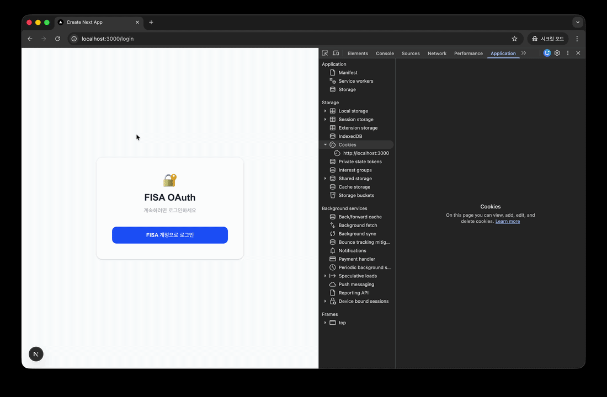

# OAuth Client 


# 실행 흐름
```
1.	클라이언트 로그인 요청
→ http://localhost:3000/login

2.	Auth.js가 OAuth 로그인 시작
→ http://localhost:9000/oauth2/authorize?client_id=test-client ...

3.	인증 필요 → 인증 서버 로그인 페이지 이동
→ http://localhost:9000/login

4.	로그인 성공 후 authorize endpoint 처리
→ http://localhost:9000/oauth2/authorize

5.	Consent 페이지 (권한 동의)
→ http://localhost:9000/oauth2/consent?scope=openid...

6.	Authorization Code 발급
→ redirect
http://localhost:3000/api/auth/callback/test-client?code=xxx&state=xxx

7.	Auth.js가 Authorization Code로 토큰 요청
→ POST http://localhost:9000/oauth2/token

8.	Authorization Server → Access Token / ID Token 발급

9.	Auth.js가 Next.js 세션 생성
→ authjs.session-token 쿠키 저장

10.	Next.js가 Access Token으로 Resource Server 호출
→ http://localhost:8000/api/profile
→ Authorization: Bearer access_token
```

# 상세 설명

## 1. 브라우저 로그인 시
1. lh:3000/login : next.js 로그인 요청
2. lh:9000/oauth2/authorize 
    - client_id, scope, redirect_uri, state, PKCE(code_challenge) 등의 파라미터가 함께 전달됨
    - Authorization Server는 이 요청을 기반으로 로그인 여부 확인 후 인증 흐름을 진행
    - redirect_uri는 인증 완료 후 Authorization Code를 전달할 주소
3. lh:9000/login : auth server의 로그인 창으로 리다이렉트됨



## 2. 회원가입 이후 consent 화면으로 이동

1. /register : 사용자가 인증 서버에서 회원가입을 수행
2. (redirect) /authorize : 인증 서버가 요청 수행

    ```
    GET /oauth2/authorize
    ?response_type=code
    &client_id=test-client
    &scope=openid profile email
    &redirect_uri=...
    &state=...
    ```
    서버는 다음과 같은 사항을 확인한다.
    - 사용자가 로그인했는지 
    - 요청한 scope가 무엇인지
    - client_id가 이미 등록된 클라이언트인지
    
    이후 문제가 없다면 동의 화면으로 이동함.


3. (redirect) /consent : 사용자 권한 동의 화면
4. 사용자가 동의할 항목을 선택한 후 submit 버튼을 누르면 auth server는 Authorization code를 생성한 후, 처음 요청에 포함되어있던 redirect_uri를 확인하여 해당 주소로 사용자를 이동시킨다.


## 동의 버튼 클릭 이후

1. /authorize
2. (redirect) /api/auth/callback/… : auth server가 redirect하면서 URL에 코드를 붙여서 전달함.
주소를 자세히 보면 다음과 같다.
```
http://localhost:3000/api/auth/callback/fisa?code=xvAnujHY7lPdwcGLtboQYy1B0ZIV6NU8omBLIGmF9Z7TxtgJdjp5Gx39tRQo5d-8HkVGegsGkT_kpanwy93cwMNnq2gKEGN67prtKpXGDl2AcPsiANuta52gXm8tJw4o&state=eyJhbGciOiJkaXIiLCJlbmMiOiJBMjU2Q0JDLUhTNTEyIiwia2lkIjoiMTlRQWhGRXpSN3B6Y29obWJvaHE2bVhvSVRiQVhDZjdUbHNSS28zN0JLWU94Y2xVTjE0OHk2OF9BMldjWjlVWUhxbGpzWTdNMk9OWV8tNmY5bnZHM1EifQ..HGvuEu4lm07uT5gUvcFXhw._iUlCza_UJjcSjFxe10mrE7OCGtMViVbMhwiElETNZo8Q4oqiRWifC2ToXR11gUVhNNENsFFaTosiidSLXCtL-jElPg0E8-ZvhM10Kz4RS_uJdZflSDD2y9BNkLZTMyBw5yUYy5eD5Cl4CrM7OORNlOg_oj_yGW5Ua1Ug55anETxWkfDQ5tjZhvfEFUOdV8_.3ym8RHAAw29-g2Ro9pbcizXs9tHZY3nwXmJS_V_RbHs
```
임시 auth code가 포함되어있는 것을 볼 수 있다.
해당 url 형식(api/auth/callback/{client_id})은 auth.js의 내부 설정값이므로 서버에서 맞춰줘야한다.



이후 next.js 서버에서 토큰 발급 요청을 보냄.
1. lh:9000/oauth2/token: 토큰 값 받아오기
2. authjs.session-token -> access token + 사용자 정보 암호화 저장

next auth.js는 jwt를 사용하여 세션을 관리하며, 토큰 내부에 auth 서버로부터 받은 access token을 함께 암호화해서 저장한다.
그래서 next 서버가 껐다 켜져도 브라우저 쿠키에 해당 값들이 남아있으면 세션 복원이 가능함.


> authjs.session-token = 암호화된(Access Token + 유저정보 + 만료시간)


## 토큰 발급 이후 애플리케이션 로직
Access Token을 발급받았으니 이제 리소스 서버에 접근할 수 있다. 
1. lh:8080/userinfo: access token으로 resource server에 요청해서 사용자 정보 받아오기
2. /dashboard : 받아온 정보로 대시보드 렌더링


